<br/>

## 📈 The machine, live

Four native engines run paper capital continuously. This chart isn't a mockup —
**the platform publishes it about itself, hourly**, from the same GIPS-anchored,
flow-excluded return math the operator sees. When the pipeline stalls, the
badges say *stale* instead of pretending.

<picture>
  <source media="(prefers-color-scheme: dark)" srcset="https://gist.githubusercontent.com/brandopakel/3d5221d75396e949427b7b6c88a80042/raw/nav_chart_dark.svg">
  
</picture>

    

<sub>The **Naive** engine is the deliberately-simple control group — the other
three exist to beat it. Architecture, doctrine, and the full numbers live in
**[omnivest-architecture](https://github.com/brandopakel/omnivest-architecture)**.</sub>

## ⚙️ What that machine is

**Omnivest** — an institutional portfolio-intelligence and autonomous research
platform, built solo, running local-first on one workstation:

```text
1,608,474 lines of Python  →  orchestrating 27 native services
   41,920 lines of Go      →  dispatch · data plane · collectors
   15,301 lines of Rust    →  allocation & pricing kernels (PyO3)
   11,489 lines of OCaml   →  13 independent verification lanes
    4,648 lines of C++     →  execution planner · limit order book
      691 SQL migrations   ·  ~16,000 tests  ·  0 cloud dependencies
```

Every quantitative result that gates a decision is re-derived by a second
implementation in a different language — a bug has to happen twice,
independently, to survive.

## 🛠 Selected work

|  | | |
|---|---|---|
| 🏛 | [omnivest-architecture](https://github.com/brandopakel/omnivest-architecture) | the deep-dive: 10-layer model, evidence-governed learning, live track record |
| ⚡ | [memkv](https://github.com/brandopakel/memkv) | Redis-inspired in-memory DB in Go — RESP protocol, epoll/kqueue event loop, skip lists, bloom filters |
| 🧹 | [hubspot-clean](https://github.com/brandopakel/hubspot-clean) | CLI that audits HubSpot CRM records for data-hygiene issues |
| 🔍 | [ringlead-dedup-review](https://github.com/brandopakel/ringlead-dedup-review) | triage for dedup exports — only groups needing human review get opened |
| 📐 | [python_for_finance](https://github.com/brandopakel/python_for_finance) | quant workbook: option pricing, stochastic processes, MCMC, optimization |

## 🧭 How I build

**Fail-closed** — missing authority stops the system; it never guesses.  
**Measured, never assumed** — fees, schemas, and thresholds read from the source of truth.  
**Native where it counts** — Go for the foundation; Rust for kernels; OCaml to check the math; Python for the ML.  
**Evidence-governed** — strategy changes ship like releases: immutable artifacts, incumbent-relative gates, atomic rollback.

---

<sub>📍 [omnivest.io](https://omnivest.io) · the older repos below are learning
artifacts — dated, kept honestly.</sub>
