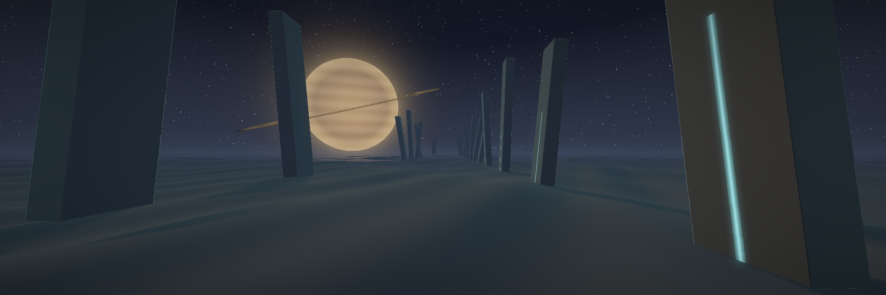

<p align="center"><sub>rendered in-house by <a href="assets/render_monolith_approach.py">a hand-written signed-distance-field raymarcher</a> — ~300 lines of numpy, no engine</sub></p>



<p align="center"><em>somewhere between the terminal and the stars</em></p>

## 🛰 Ship manifest

```text
CALLSIGN ......... bp
CLASS ............ systems engineer
REGISTRY ......... Sol-3 / Earth
DRIVE ............ curiosity, compiled
NAVIGATION ....... by first principles; dead reckoning when the docs are wrong
CARGO ............ five programming languages, one strong opinion about each
KNOWN ANOMALY .... believes the future is a distribution, not a promise
```


> *"The sky above the port was the color of television, tuned to a dead channel."*
> — William Gibson, **Neuromancer**

> *"Violence is the last refuge of the incompetent."*
> — Isaac Asimov, **Foundation**

> *"I am putting myself to the fullest possible use, which is all I think that any conscious entity can ever hope to do."*
> — HAL 9000, **2001: A Space Odyssey**

## 📡 Hailing frequencies

Open. If your transmission concerns starships, markets, compilers, or why
psychohistory is just backtesting at civilizational scale — expect a reply.

---

<p align="center"><sub>⬛ END OF TRANSMISSION — this console will update when the future arrives</sub></p>
